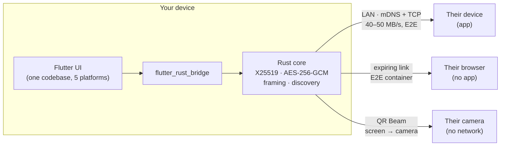

<div align="center">


# BIShare

**AirDrop for every device.** Send files between iPhone, Android, Mac, Windows
& Linux — directly, end-to-end encrypted, at full Wi-Fi speed. The other side
doesn't even need the app: any browser works.

No account. No ads. No cloud in the middle. Free & open source.

[](https://github.com/BIShare-project/bishare-flutter/actions/workflows/ci.yml)
[](https://github.com/BIShare-project/bishare-flutter/releases/latest)
[](https://github.com/BIShare-project/bishare-flutter/releases)


[](LICENSE)

[](https://apps.apple.com/us/app/bishare-file-transfer/id6760924092)
[](https://play.google.com/store/apps/details?id=com.bishare.app)
[](https://github.com/BIShare-project/bishare-flutter/releases/latest)
[](https://github.com/BIShare-project/bishare-flutter/releases/latest)
[](https://bishare.app/transfer)


**[🌐 bishare.app](https://bishare.app)** &nbsp;·&nbsp; **[📥 All downloads](https://bishare.app/download)** &nbsp;·&nbsp; **[🚀 Try it in your browser right now](https://bishare.app/transfer)**

</div>

---

## Why this exists

Every platform solved file sharing — for itself. AirDrop stops at the Apple
wall. Quick Share skips iPhones. SHAREit buried the feature under ads.
WeTransfer uploads your file to a server across the continent so it can come
back down the same street. Meanwhile the two devices are **three meters apart**.

BIShare is the missing neutral ground: **one app for all five platforms**, where
the file travels **directly device-to-device** over your own network — and when
the other person has nothing installed, they receive it in a **plain browser
tab**.

## How it compares

|  | BIShare | AirDrop | Quick Share | LocalSend | SHAREit | WeTransfer |
|---|:---:|:---:|:---:|:---:|:---:|:---:|
| iPhone ↔ Android ↔ Windows ↔ Mac ↔ Linux | ✅ | ❌ Apple only | ❌ no iOS | ✅ | ✅ | ✅ |
| Direct LAN transfer (no cloud upload) | ✅ | ✅ | ✅ | ✅ | ✅ | ❌ |
| Receiver needs **no app** (browser receive) | ✅ | ❌ | ❌ | ❌ | ❌ | ✅ |
| Remote share link when you're apart | ✅ | ❌ | ❌ | ❌ | ❌ | ✅ |
| End-to-end encrypted | ✅ | ✅ | ✅ | ⚠️ TLS | ❌ | ❌ |
| No ads, no account required | ✅ | ✅ | ✅ | ✅ | ❌ | ⚠️ caps |
| Open source | ✅ | ❌ | ❌ | ✅ | ❌ | ❌ |
| Group rooms · clipboard sync · QR Beam | ✅ | ❌ | ❌ | ❌ | ❌ | ❌ |

*LocalSend is excellent open-source software and an inspiration — BIShare's
different bets are the no-app browser path, remote links for far-away
recipients, and a Rust protocol core shared across every platform.*

## How fast?

Measured on ordinary hardware (Wi-Fi 5 network, mid-range phones), release
builds:

| Path | Throughput | 1 GB video takes |
|---|---|---|
| **BIShare, same Wi-Fi** | **40–50 MB/s** | **~25 seconds** |
| Typical cloud service (30 Mbps home upload) | ~3.7 MB/s up, then the download | ~5 minutes before the receiver can even start |

The speed isn't magic — it's the absence of a detour. The file crosses your
router once instead of crossing the internet twice. Crypto runs on hardware AES
in a Rust core, so encryption is never the bottleneck — we learned that lesson
[the hard way](https://bishare.app/blog/transfer-files-from-iphone-to-windows-without-cable)
when a build flag once silently disabled it.

## Features

| | |
|---|---|
| 🚀 **Direct LAN transfer** — device-to-device at Wi-Fi speed, nothing uploaded | 🔒 **End-to-end encrypted** — X25519 key exchange + AES-256-GCM per file |
| 🌐 **Browser receive & send** — the other side needs zero installs | 🔗 **Remote share** — link + QR + 6-char code, auto-expiring |
| 📡 **Works offline** — phone hotspot is enough; no internet required | 🔳 **QR Beam** — no network at all: file streams screen → camera as animated QR |
| 👥 **Rooms** — live group sharing with everyone in one place | 📋 **Universal clipboard** — copy on one device, paste on another |
| 📥 **Inbox & history** — gallery, search, save to Photos, CSV export | 🖥️ **System tray, drag & drop** — real desktop citizenship on Win/Mac/Linux |
| 🌍 **13 languages** — easiest contribution: add yours! | 🙅 **No account, no ads, no tracking** — ephemeral by design |

## Download

| Platform | Get it |
|---|---|
| **iPhone / iPad / Mac** | [App Store](https://apps.apple.com/us/app/bishare-file-transfer/id6760924092) |
| **Android** | [Google Play](https://play.google.com/store/apps/details?id=com.bishare.app) · [APK from Releases](https://github.com/BIShare-project/bishare-flutter/releases/latest) |
| **Windows** | [`BIShare-*-windows-x64.zip`](https://github.com/BIShare-project/bishare-flutter/releases/latest) |
| **Linux** | [`BIShare-*-linux-x64.tar.gz`](https://github.com/BIShare-project/bishare-flutter/releases/latest) |
| **Any browser** | Nothing to install — [bishare.app/transfer](https://bishare.app/transfer) |

**Windows via Scoop:**

```powershell
scoop install https://raw.githubusercontent.com/BIShare-project/bishare-flutter/main/packaging/scoop/bishare.json
```

## How it works

BIShare picks the best path automatically, so sending is always one step:

1. **Same Wi-Fi / hotspot** — devices find each other via mDNS and the file
   streams directly, end-to-end encrypted. Works with zero internet.
2. **Far apart** — you get a link, QR code, and 6-character code; the recipient
   opens it in any browser. Links expire on their own.
3. **No network at all** — QR Beam turns a small file into an animated stream of
   QR codes; the receiving camera rebuilds it. Screen → camera, nothing else.



**Private by default**: nearby transfers never leave your network, there's no
account, nothing lingers on a server, and the crypto lives in a single
[Rust crate](https://github.com/BIShare-project/bishare-protocol) shared by
every platform — one implementation to review instead of five. Details in
[SECURITY.md](SECURITY.md).

## Getting started (from source)

**Prerequisites**: [Flutter SDK](https://docs.flutter.dev/get-started/install)
(Dart ≥ 3.11), [Rust toolchain](https://rustup.rs/), plus the platform toolchain
you target (Xcode / Android Studio / Visual Studio / GTK+Clang).

```bash
flutter pub get
dart run build_runner build --delete-conflicting-outputs
flutter run -d macos      # or: ios | android | windows | linux
```

> First build compiles the Rust core, so it takes a few minutes. After that,
> builds are incremental.

```bash
flutter analyze     # static analysis
flutter test        # unit tests (incl. crypto round-trip vectors)
```

## Project structure

```
lib/
├─ app/                 # app shell, router, bootstrap
├─ core/                # crypto, receiver server, identity, rust facade, UI kit
├─ features/            # feature-first slices:
│  ├─ send/ receive/ nearby/ qr_beam/     # transfer paths
│  ├─ remote/ room/ clipboard/            # link share, groups, clipboard
│  └─ inbox/ history/ file_manager/ …     # received files & records
└─ src/rust/            # generated flutter_rust_bridge bindings

rust/                   # native crate (bishare_ffi) — crypto + protocol
assets/translations/    # 13-locale JSON catalogs
```

Deep dive: **[ARCHITECTURE.md](ARCHITECTURE.md)**

## Contributing

Three ways in, smallest first:

1. **🌍 Add or improve a language** — no build needed, just a text editor and
   ~15 minutes. 13 languages ship today; yours could be next.
   [docs/TRANSLATIONS.md](docs/TRANSLATIONS.md) has the 3-edit walkthrough.
2. **🐣 Pick a [`good first issue`](https://github.com/BIShare-project/bishare-flutter/labels/good%20first%20issue)** —
   scoped, mentored, and labeled by area.
3. **🧪 Test your platform combo** — five platforms × transports means real
   devices always beat our matrix. An issue titled "Pixel 6 → Fedora 40: X
   happened" is genuinely valuable.

Workflow: fork → branch → `flutter analyze` + `flutter test` → PR. Keep
user-facing strings localized. Full guide in
**[CONTRIBUTING.md](CONTRIBUTING.md)**; direction lives in the
[**roadmap**](ROADMAP.md). For larger features, open an issue first so we can
align.

## FAQ

**Does the other person need BIShare?**
No. On the same network they can receive (and send) from a plain browser tab
via [bishare.app/transfer](https://bishare.app/transfer). Far away, they just
open your link.

**Does it work iPhone → Windows? Android → Mac?**
Yes — any direction between iOS, Android, macOS, Windows, Linux, and browsers.
That's the point.

**Is there a file size limit on local transfers?**
No. LAN transfers are bounded by the receiver's disk, not by us. Multi-gigabyte
videos are the normal case.

**What does the server see on a local transfer?**
Nothing — there is no server in the path. Discovery and transfer stay on your
network. Remote share links use end-to-end encrypted containers with expiry.

**How is this different from LocalSend?**
See [the comparison](#how-it-compares) — short version: browser receive with no
app, remote links for far-away recipients, rooms/clipboard/QR Beam, and a Rust
protocol core. Use whichever fits; both beat the cloud detour.

## Related repositories

| Repo | What it is |
|---|---|
| [`bishare-protocol`](https://github.com/BIShare-project/bishare-protocol) | The Rust protocol + crypto crate this app embeds |
| [`bishare-web`](https://github.com/BIShare-project/bishare-web) | bishare.app — website, browser transfer, rooms |

## License

[MIT](LICENSE) — free to use, modify, and distribute.

---

<div align="center">

**If BIShare saved you an email-to-self today, a ⭐ helps other people find it.**

**[Website](https://bishare.app)** · **[Download](https://bishare.app/download)** · **[App Store](https://apps.apple.com/us/app/bishare-file-transfer/id6760924092)** · **[Google Play](https://play.google.com/store/apps/details?id=com.bishare.app)** · **[Web App](https://bishare.app/transfer)**

Made with Flutter & Rust · [bishare.app](https://bishare.app)

</div>
