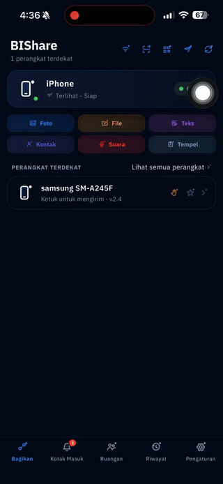

<div align="center">

# BIShare

**Fast, private, cross-platform file sharing — like AirDrop, but for every device.**

Send any file between iPhone, Android, Mac, Windows, and Linux. Instant and
end-to-end encrypted over your local network, or a link the other side opens in
any browser. No account, no ads, no cloud in the middle.

[](https://github.com/BIShare-project/bishare-flutter/actions/workflows/ci.yml)


**[🌐 bishare.app](https://bishare.app)** &nbsp;·&nbsp; **[📥 Download](https://bishare.app/download)** &nbsp;·&nbsp; **[🚀 Try it in the browser](https://bishare.app/transfer)**

[](https://apps.apple.com/us/app/bishare-file-transfer/id6760924092)
[](https://play.google.com/store/apps/details?id=com.bishare.app)
[](https://bishare.app/transfer)

</div>

---

## Why BIShare?

AirDrop is Apple-only. Android's Quick Share skips iPhones. WeTransfer caps free
transfers and routes everything through the cloud. BIShare fills the gap: **one
app for every platform**, with the file going **directly device-to-device** when
you're on the same network — no upload, no server, no waiting.

## Demo

<!-- Drop a short screen recording at docs/demo.gif (e.g. sending a file phone → laptop
     over the LAN) and uncomment the line below so it renders here. -->
<!-- <div align="center"></div> -->

> 📹 A short demo GIF goes here — sending a file device-to-device. See
> [`docs/`](docs/) to contribute screenshots or a recording.

## Download

| Platform | Where |
|---|---|
| **iOS & macOS** | [App Store](https://apps.apple.com/us/app/bishare-file-transfer/id6760924092) |
| **Android** | [Google Play](https://play.google.com/store/apps/details?id=com.bishare.app) |
| **Web** | Use it in any browser — [bishare.app/transfer](https://bishare.app/transfer) |
| **Windows & Linux** | Build from source (see [Getting started](#getting-started)) |

Website: **[bishare.app](https://bishare.app)** · All downloads: **[bishare.app/download](https://bishare.app/download)**

## Features

- 🚀 **Local-network transfer** — files stream straight between devices over
  Wi-Fi at full speed. Nothing is uploaded to a server.
- 🔒 **End-to-end encrypted** — X25519 key exchange + AES-256-GCM with per-file
  keys. Only the sender and receiver can read the data.
- 📡 **Nearby & offline** — devices discover each other automatically over the
  LAN (mDNS); transfer works even over a phone hotspot with no internet.
- 🔳 **QR Beam** — send a small file with **no network at all**: the sender's
  screen shows an animated stream of QR codes and the receiver's camera scans
  them (purely screen → camera). Great for text, keys, and small docs.
- 🔗 **Remote share** — for devices that aren't nearby, get a link, QR code, and
  6-character code the recipient opens in any browser — no app on their end.
- 👥 **Rooms** — share files with a group in a live, shared room.
- 📋 **Universal clipboard** — sync clipboard content across your own devices.
- 📥 **Inbox & history** — received files land in an inbox with a gallery, plus
  searchable transfer history.
- 🖥️ **Truly cross-platform** — one Dart/Flutter codebase for **iOS, Android,
  macOS, Windows, and Linux**.
- 🙅 **No account, no ads** — nothing to sign up for; ephemeral by design.
- 🌍 **13 languages** — English, Indonesian, Spanish, French, German, Portuguese
  (BR), Russian, Arabic, Hindi, Japanese, Korean, and Simplified/Traditional
  Chinese.

## How it works

BIShare picks the best path automatically, so sending a file is always one step:

1. **On the same Wi-Fi** — devices discover each other over mDNS and the file
   streams **directly device-to-device**, end-to-end encrypted (X25519 +
   AES-256-GCM). Nothing is uploaded; it's as fast as your network. Works even
   over a phone hotspot with no internet.
2. **Far away** — BIShare gives you a **link, QR code, and 6-character code**. The
   recipient opens the link in any browser and downloads — no app or account on
   their end. Links auto-expire.
3. **No network at all** — **QR Beam** turns a small file into an animated stream
   of QR codes on the sender's screen; the receiver's camera scans them to
   rebuild the file. Purely screen → camera, for text, keys, and small docs.

Everything is designed to be **private by default**: nearby transfers never leave
your local network, there's no account, and nothing lingers on a server.

## Supported platforms

| Android | iOS | macOS | Windows | Linux |
|:---:|:---:|:---:|:---:|:---:|
| ✅ | ✅ | ✅ | ✅ | ✅ |

## Tech stack

- **[Flutter](https://flutter.dev/)** (Dart) — a single UI codebase across all platforms.
- **Rust core** via **[flutter_rust_bridge](https://github.com/fzyzcjy/flutter_rust_bridge)** —
  the cryptography and protocol primitives (X25519, AES-256-GCM, framing,
  filename sanitisation) live in a shared Rust crate for correctness and speed.
- **State & DI** — `flutter_bloc` (Cubit) + `get_it`.
- **Routing** — `go_router`.
- **Networking** — `shelf` (receiver server), `dio` (sender client),
  `bonsoir` (mDNS/Bonjour discovery).
- **Storage** — `drift` (SQLite) for history + favorites.
- **QR** — `qr_flutter` (generate) + `mobile_scanner` (scan).
- **UI** — `shadcn_ui`.
- **i18n** — `easy_localization`.

## Getting started

### Prerequisites

- [Flutter SDK](https://docs.flutter.dev/get-started/install) (Dart SDK ≥ 3.11).
- [Rust toolchain](https://rustup.rs/) (`rustc` + `cargo`) — the native crypto
  core is built from source via flutter_rust_bridge.
- Platform toolchains for whatever you target (Xcode for iOS/macOS, Android
  Studio / NDK for Android, Visual Studio for Windows, GTK/Clang for Linux).

### Run

```bash
# 1. Install Dart/Flutter dependencies
flutter pub get

# 2. Generate the serialization code (*.g.dart)
dart run build_runner build --delete-conflicting-outputs

# 3. Run on a connected device or desktop
flutter run -d macos      # or: ios | android | windows | linux
```

> The first build compiles the Rust core, so it takes longer than a pure-Dart
> app. Subsequent builds are incremental.

### Checks

```bash
flutter analyze     # static analysis
flutter test        # unit tests (incl. crypto round-trip)
```

## Project structure

```
lib/
├─ app/                 # app shell, router, bootstrap
├─ core/                # cross-cutting services
│  ├─ crypto/           #   E2E crypto (Dart side)
│  ├─ server/           #   receiver (shelf) — inbox/history pipeline
│  ├─ identity/         #   device identity, keypair
│  ├─ rust/             #   flutter_rust_bridge facade
│  └─ ui/               #   shared design-system widgets
├─ features/            # feature-first vertical slices
│  ├─ send/  receive/   #   transfer flows
│  ├─ nearby/           #   offline device discovery + send
│  ├─ qr_beam/          #   QR-stream offline transfer
│  ├─ remote/  room/    #   link/QR/code + group sharing
│  ├─ inbox/  history/  #   received files + records
│  └─ ...               #   home, settings, clipboard, file_manager, …
└─ src/rust/            # generated flutter_rust_bridge bindings

rust/                   # the native crate (bishare_ffi) exposed to Dart
assets/translations/    # 13-locale JSON message catalogs
```

## Contributing

Contributions are welcome!

1. Fork the repo and create a feature branch (`git checkout -b feat/my-feature`).
2. Make your change and run `flutter analyze` + `flutter test`.
3. Keep user-facing strings localized — add keys to **all** files in
   `assets/translations/`.
4. Open a pull request describing the change.

Please open an issue first for larger features so we can align on direction.

## License

Released under the [MIT License](LICENSE) — free to use, modify, and distribute.

---

<div align="center">

**[Website](https://bishare.app)** · **[Download](https://bishare.app/download)** · **[App Store](https://apps.apple.com/us/app/bishare-file-transfer/id6760924092)** · **[Google Play](https://play.google.com/store/apps/details?id=com.bishare.app)** · **[Web App](https://bishare.app/transfer)**

Made with Flutter &amp; Rust · [bishare.app](https://bishare.app)

</div>
